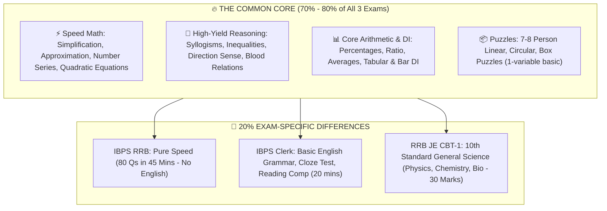

# 30-Day Emergency Crash Blueprint: IBPS RRB (Gramin Bank) + IBPS Clerk + RRB JE (CEN 04/2026)

> **Profile Target:** 2026 Batch Fresher / B.Tech CSE (Diploma Lateral Entry)  
> **Exams Scheduled:** End of This Month  
> **Target Status:** Forms already submitted. Total focus on Clearing Prelims / CBT-1 Cutoffs with High Efficiency.

---

## 1. The 3 Applied Exams: At a Glance

| Parameter | 1. IBPS RRB 15th (Gramin Bank) | 2. IBPS Clerk CRP XVI | 3. Railway RRB JE (CEN 04/2026) |
| :--- | :--- | :--- | :--- |
| **Posts** | Office Assistant & Officer Scale-I (13,706+ Vacancies) | Clerical Cadre / Customer Service Associate | Junior Engineer (IT / Works / Electronics) |
| **Stage** | **Prelims Exam** | **Prelims Exam** | **CBT-1 (Screening Test)** |
| **Total Marks** | **80 Marks** | **100 Marks** | **100 Marks** |
| **Total Questions**| **80 Questions** | **100 Questions** | **100 Questions** |
| **Total Time** | **45 Minutes** (Composite — No Sectional Limits!) | **60 Minutes** (Strict 20 mins per section) | **90 Minutes** (Total flexibility) |
| **Negative Marks** | 0.25 (1/4th) | 0.25 (1/4th) | 0.33 (1/3rd) |
| **Crucial Secret** | **NO ENGLISH in Prelims!** Pure Quant + Reasoning. | English (30) + Quant (35) + Reasoning (35). | Maths (30) + Science (30) + Reasoning (25) + GA (15). |
| **Target Cutoff (EWS/UR)**| **Office Asst: ~70/80** \| **PO: ~52-58/80** | **~72 - 78 / 100** | **~62 - 68 / 100** (To qualify for CBT-2) |

---

## 2. The Universal Overlap Strategy (How to Prepare for All 3 Together)

Instead of studying 3 different syllabi, exploit the **80% mathematical and logical overlap**:



---

## 3. High-Yield Topic Priority Matrix

### A. Quantitative Aptitude & Mathematics (Common to ALL 3)
| Priority | Topic | Questions in IBPS RRB | Questions in IBPS Clerk | Questions in RRB JE | Why You Must Master This First |
| :--- | :--- | :--- | :--- | :--- | :--- |
| **P0 (Must-Do)** | **Simplification & Approximation** | 10 - 15 Qs | 10 - 15 Qs | 4 - 5 Qs | Pure calculation. 100% accuracy possible in 5-7 minutes using BODMAS & tables. |
| **P0 (Must-Do)** | **Missing / Wrong Number Series** | 5 Qs | 5 Qs | 2 - 3 Qs | 5 fixed patterns: difference, double difference, alternating multiply/add, squares/cubes. |
| **P0 (Must-Do)** | **Quadratic Equations ($ax^2+bx+c=0$)**| 5 Qs | 5 Qs | 1 - 2 Qs | Sign method trick solves 5 equations in under 2 minutes. |
| **P1** | **Data Interpretation (Table / Bar / Line)** | 10 Qs (2 sets) | 5 Qs (1 set) | 3 - 4 Qs | Pure application of Percentage + Ratio + Average. No complex formulas needed. |
| **P1** | **Core Arithmetic: Percentage, Ratio, Average**| 4 - 5 Qs | 4 - 5 Qs | 5 - 6 Qs | Backbone of all word problems. |
| **P2** | **Time & Work + Speed, Time & Distance** | 3 - 4 Qs | 3 - 4 Qs | 4 - 5 Qs | LCM method for Time & Work gives instant answers. |
| **Total Marks** | | **40 Marks** | **35 Marks** | **30 Marks** | |

---

### B. Reasoning Ability (Common to ALL 3)
| Priority | Topic | Questions in IBPS RRB | Questions in IBPS Clerk | Questions in RRB JE | Strategy / Speed Trick |
| :--- | :--- | :--- | :--- | :--- | :--- |
| **P0 (Must-Do)** | **Syllogism (Only A few, Some, All, No)** | 5 Qs | 5 Qs | 3 - 4 Qs | Venn diagram method. Takes 1.5 minutes for 5 marks. |
| **P0 (Must-Do)** | **Inequalities ($A > B \ge C = D$)** | 5 Qs | 5 Qs | 2 - 3 Qs | Open-gate / closed-gate visual trick. Takes 1 minute for 5 marks. |
| **P0 (Must-Do)** | **Alpha-Numeric-Symbol Series** | 5 Qs | 5 Qs | 3 - 4 Qs | Pure visual spotting. Free 5 marks in clerk & RRB. |
| **P1** | **Coding-Decoding (Chinese Substitution)**| 5 Qs | 5 Qs | 3 - 4 Qs | Common-word elimination method. |
| **P1** | **Direction Sense & Blood Relations** | 5 Qs | 3 - 4 Qs | 3 - 4 Qs | Draw small diagram; never guess. |
| **P2** | **Seating Arrangement & Puzzles (1-Variable)**| 15 Qs (3 sets) | 12 - 15 Qs | 3 - 5 Qs | Practice 7-person circular facing inside, and 7-day linear/box puzzle. |
| **Total Marks** | | **40 Marks** | **35 Marks** | **25 Marks** | |

---

### C. The Differentiators (Exam-Specific High Yield)
1. **For IBPS Clerk (English - 30 Marks):**
   - **Reading Comprehension (8-10 Qs):** Direct story or business article. Answer vocab questions first, then direct fact questions.
   - **Cloze Test (5 Qs):** Fill in the blanks based on sentence tone.
   - **Error Detection (5 Qs):** Subject-verb agreement, preposition usage, tense consistency.
   - **Sentence Rearrangement (5 Qs):** Identify the first opening sentence and the closing sentence first.
   - *Target Score in 20 Mins:* **20 - 24 Marks**.

2. **For RRB JE CBT-1 (General Science - 30 Marks):**
   - **Physics (10-12 Qs):** Ohm's Law ($V = IR$), Power ($P = VI$), Lens formula, Work & Energy ($W = Fs$, $KE = \frac{1}{2}mv^2$, $PE = mgh$), Newton's laws.
   - **Chemistry (10-12 Qs):** Periodic table groups (Alkali metals, Halogens, Noble gases), Acids, Bases & Salts (pH scale, Bleaching powder, Baking soda formulas), Chemical reactions (Redox, Displacement).
   - **Life Sciences (6-8 Qs):** Human digestive & circulatory system, Plant tissues (Xylem/Phloem), Vitamins & deficiency diseases, Cell organelles (Mitochondria, Ribosomes).
   - *Target Score in 20 Mins:* **22 - 25 Marks** (Pure factual recall — either you know it or you don't!).

---

## 4. Time Allocation & Section Strategy During the Actual Exams

### Exam 1: IBPS RRB (Gramin Bank) Prelims (45 Mins Total)
*Remember: There is NO sectional timer! You have full control.*
- **First 22 Minutes $\rightarrow$ Reasoning Ability:**
  - Start with Inequalities (1 min) $\rightarrow$ Syllogisms (1.5 mins) $\rightarrow$ Direction/Coding (3 mins) $\rightarrow$ Easy 2 Puzzles (8 mins).
  - *Goal: 32+ Attempts in 22 minutes.*
- **Next 23 Minutes $\rightarrow$ Quantitative Aptitude:**
  - Start with Simplification/Approximation (6 mins) $\rightarrow$ Quadratic Equations (2 mins) $\rightarrow$ Number Series (3 mins) $\rightarrow$ 1 Easy DI Set (5 mins) $\rightarrow$ 4-5 Arithmetic questions (6 mins).
  - *Goal: 30+ Attempts in 23 minutes.*
- **Expected Total Attempts:** **62 - 70 Questions with 95%+ accuracy = Instant Selection!**

---

### Exam 2: IBPS Clerk Prelims (Strict 20 Mins per section)
- **Section 1: English (20 Mins):**
  - Errors & Fillers (5 mins) $\rightarrow$ Cloze Test (4 mins) $\rightarrow$ RC (9 mins) $\rightarrow$ Review (2 mins). Target: 22+.
- **Section 2: Numerical Ability (20 Mins):**
  - Simplification (10-15 Qs in 6 mins) $\rightarrow$ Number Series (2.5 mins) $\rightarrow$ Quadratic / DI (5 mins) $\rightarrow$ Arithmetic (5 mins). Target: 28+.
- **Section 3: Reasoning Ability (20 Mins):**
  - Inequalities + Syllogisms + Alpha series (6 mins) $\rightarrow$ Blood relation/Direction (3 mins) $\rightarrow$ 2 Puzzles (8 mins) $\rightarrow$ Remaining (3 mins). Target: 30+.
- **Expected Total Score:** **75 - 82 Marks = Clears State Cutoffs!**

---

### Exam 3: Railway RRB JE CBT-1 (90 Mins Total)
*Ample time: 90 minutes for 100 questions. Accuracy matters more than rush.*
- **Round 1 (0 to 25 mins) — General Science + General Awareness (45 Qs):**
  - Direct 1-line questions. Don't calculate. If you know, tick it. Takes ~20-25 mins.
- **Round 2 (25 to 55 mins) — Reasoning (25 Qs):**
  - Complete the entire reasoning section. You have 30 mins for 25 questions. Very relaxed pace.
- **Round 3 (55 to 85 mins) — Mathematics (30 Qs):**
  - 30 minutes for 30 questions. Solve formula-based questions first, then arithmetic word problems.
- **Buffer (85 to 90 mins):** Review marked questions.
- **Expected Score:** **68 - 75 Marks = Top 15% qualifying for CBT-2!**

---

## 5. Day-by-Day Emergency 3-Week Study Schedule

```
DAILY ROUTINE (4 to 5 Hours Daily):
├── 08:00 AM - 09:30 AM: Speed Math & Calculation Drills (Tables 1-30, Squares 1-50, Cubes 1-25, 30 Simplifications)
├── 10:30 AM - 12:00 PM: Reasoning Puzzles + Syllogism / Inequality Drills (4 Puzzles + 15 Speed Qs)
├── 03:00 PM - 04:30 PM: Science Revision (for RRB JE) OR English Sectional (for Clerk) (Alternate Days)
└── 08:30 PM - 10:00 PM: 1 FULL LENGTH SPEED MOCK TEST (RRB / Clerk / RRB JE) + Error Analysis
```

### Week 1: Speed Foundation & Formula Lockdown
* **Day 1 - 2:** Simplification (BODMAS, fractions, decimal tricks) + Inequalities + Syllogism concepts.
* **Day 3 - 4:** Number Series (5 rules) + Quadratic Equations (Sign tricks) + Direction Sense & Coding.
* **Day 5 - 6:** Data Interpretation (Table + Bar graphs) + 1-Variable Linear & Circular Puzzles.
* **Day 7:** Mock Test 1 (IBPS RRB) + Mock Test 2 (RRB JE CBT-1) + Thorough Error Review.

### Week 2: Arithmetic Core + Science Booster
* **Day 8 - 9:** Percentage, Ratio & Proportion, Averages + Physics (Ohm's Law, Motion, Light, Energy).
* **Day 10 - 11:** Time & Work, Speed-Time-Distance + Chemistry (Periodic Table, Acids & Bases, Chemical Equations).
* **Day 12 - 13:** Profit & Loss, Simple/Compound Interest + Biology (Digestive System, Vitamins, Plant Tissues).
* **Day 14:** Full Mock Test (IBPS Clerk Prelims) + Full Mock Test (IBPS RRB) + Analyze Weak Areas.

### Week 3: Mock Marathon & Accuracy Tuning
* **Day 15 - 18:** 2 Mocks per day (1 Bank Prelims + 1 RRB JE). Focus only on eliminating negative marks.
* **Day 19 - 20:** Revise formula sheets, square/cube tables, Science summary notes, and error notebook.
* **Day 21:** Relax, sleep 8 hours, prepare documents (Admit Card, Original ID + Photocopy, 2 Passport Photos). Walk into the exam room with total confidence.
