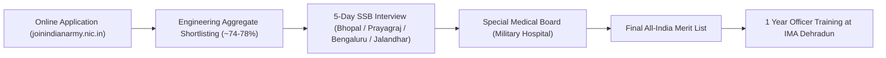

# Indian Army: Technical Graduate Course (TGC-145) — Commissioned Lieutenant

> **Entry Scheme:** 145th Technical Graduate Course (TGC-145) Commencing July 2027 at Indian Military Academy (IMA), Dehradun  
> **Commission Type:** **Permanent Commission (Group 'A' Gazetted Military Officer)**  
> **Rank on Commission:** **Lieutenant**  
> **Application Fee:** **₹0 (Completely Free — 100% Zero Cost)**  
> **Application Deadline:** **29 October 2026 (03:00 PM)**

---

## 1. Organization & Post Profiles
* **Recruiting Body:** Directorate General of Recruiting, Integrated Headquarters of Ministry of Defence (Army), New Delhi.
* **Armed Corps:** Corps of Signals (Military Cybersecurity, Satcom, Cloud, Tactical Radios), Corps of Electronics & Mechanical Engineers (EME), and Army Air Defence.
* **Role:** Lead a technical military unit of 30–50 jawans and technical soldiers. Lead military communications, tactical data networks, electronic warfare systems, drone surveillance links, and cyber command warfare.

---

## 2. Salary Structure & Allowances
* **Rank on Commission:** Lieutenant (Level 10 Defence Pay Matrix).
* **Basic Pay:** ₹56,100/month.
* **Military Service Pay (MSP):** ₹15,500/month (Fixed mandatory allowance for all military officers).
* **Dearness Allowance (DA):** 50% = ₹35,800/month.
* **High Altitude / Field Area Allowance:** ₹10,500 to ₹25,000/month (when posted in border/operational sectors like Ladakh, J&K, Arunachal Pradesh).
* **Flying Allowance / Parachute Pay:** ₹17,300 – ₹25,000/month (if qualified for Special Forces / Aviation).
* **Dress Allowance:** ₹20,000 annually.
* **Gross Starting Monthly Salary:** **~₹1,15,000 – ₹1,25,000/month** (In peace postings); **~₹1,40,000/month** in operational sectors.
* **In-Hand Starting Salary:** **~₹98,000 – ₹1,08,000/month**.

---

## 3. Benefits & Perks (Highest Prestige in India)
* **Official Military Bungalow:** Free fully-furnished government accommodation inside secure Military Cantonments.
* **Dedicated Orderly / Sahayak & Official Transport.**
* **Healthcare (ECHS):** 100% Free medical treatment for officer, spouse, children, and parents at Command Hospitals and Military Base Hospitals across India.
* **CSD Canteen Privileges:** Subsidized groceries, electronics, and motor vehicles (up to 50% tax exemption on car purchases).
* **Officers' Mess Membership:** Access to prestigious Army golf clubs, swimming pools, tennis courts, and officer messes nationwide.
* **Annual Leave:** **60 Days Annual Leave + 20 Days Casual Leave** per year (Highest leave allocation in Indian Government).
* **Free Travel Concession (LTC):** First Class / Air travel for family across India.
* **Lifelong Pension:** Defence pension under OROP framework + disability insurance of ₹1 Crore.

---

## 4. Exact Eligibility & Age Limits
* **Educational Qualification:**
  * Candidates who have passed the requisite Engineering Degree course OR are in the final year of Engineering Degree course are eligible to apply.
  * **Eligible Engineering Stream:** B.E. / B.Tech in **Computer Science & Engineering / Computer Technology / Information Technology / M.Sc Computer Science**.
  * **Diploma + Lateral Entry B.Tech:** **100% Eligible!** Indian Army accepts AICTE recognized B.Tech degree after 3-Year Polytechnic Diploma. No 12th certificate is mandatory as long as the 3-Year Diploma marksheet and B.Tech degree are produced.
* **Age Limit (As on 01 July 2027):**
  * **20 to 27 Years** (Candidates born between **02 July 2000 and 01 July 2007**, both dates inclusive).
* **Marital Status:** Unmarried Male candidates only.

---

## 5. Application Fee
* **Application Fee:** **₹0 (Zero Rupees / Free for all candidates)**.
* **Free Travel Allowance:** AC 3-Tier train fare refunded to candidates appearing for their first SSB interview.

---

## 6. Official Links & Application Portals
* **Official Indian Army Portal:** [https://joinindianarmy.nic.in](https://joinindianarmy.nic.in)
* **Direct Apply Tab:** Navigate to "Officers Selection" $\rightarrow$ "Apply/Login" on [joinindianarmy.nic.in](https://joinindianarmy.nic.in).

---

## 7. Required Documents Checklist
1. **Matriculation / 10th Class Certificate & Marksheet:** Issued by recognized board showing Date of Birth.
2. **3-Year Polytechnic Diploma Certificate & Marksheets** (All Semesters).
3. **Engineering Degree / Provisional Degree Certificate** and marksheets of all semesters up to 6th / 8th semester.
4. **Cumulative CGPA to Percentage Conversion Certificate** signed by College Principal/Registrar.
5. **Passport Size Photographs:** 20 copies of recent passport size photographs (white background, light clothes).
6. **Valid Photo ID Proof:** Original Aadhaar Card and Voter ID / Passport.

---

## 8. Selection Process & Evaluation Pattern (ZERO WRITTEN EXAM)
There is **NO written test**. Selection is purely through academic shortlisting followed by the legendary 5-Day Services Selection Board (SSB) Interview.

### Stage 1: Day 1 (Screening Test)
* **Officer Intelligence Rating (OIR) Test:** 2 sets of Verbal and Non-Verbal reasoning questions (40 questions each, 30 minutes). Score of OIR-1 or OIR-2 ensures qualification.
* **Picture Perception and Description Test (PPDT):** A hazy picture shown for 30 seconds. Write a 1-minute character description + 3-minute story. Followed by Group Discussion.

### Stage 2: Days 2 to 5 (Full Assessment)
* **Psychological Tests (Day 2):**
  * Thematic Apperception Test (TAT): 11 pictures + 1 blank slide (write 12 stories).
  * Word Association Test (WAT): 60 words flashed for 15 seconds each (write spontaneous reactions).
  * Situation Reaction Test (SRT): 60 real-life crisis situations in 30 minutes.
  * Self Description (SD): Opinions of parents, teachers, friends, and self.
* **Group Testing Officer (GTO) Tasks (Days 3 & 4):**
  * Group Discussions, Group Planning Exercise (GPE), Progressive Group Task (PGT), Half Group Task (HGT), Individual Obstacles (10 physical tasks), Snake Race, Command Task, Lecturette.
* **Personal Interview:** Conducted by the Board President / Deputy President (Questions on engineering projects, current affairs, family background, military awareness).
* **Conference (Day 5):** Final recommendation board meeting.

---

## 9. Complete Detailed Syllabus / Assessment Areas
* **OIR Preparation:** Analogy, Classification, Series Completion, Coding-Decoding, Blood Relations, Direction Sense, Cube and Dice problems, Pattern Folding, Embedded Figures.
* **General Awareness for Lecturette & Interview:**
  * India's Defence Modernization (Theater Commands, INS Vikrant, Tejas Mk1A, S-400).
  * Cybersecurity & Military Artificial Intelligence.
  * Geopolitical alignments: Quad, BRICS, Indo-Pacific dynamics, India-China border situation.
  * Core Engineering: Explaining your B.Tech final year project in simple layman terms.

---

## 10. Cutoff Trends (Shortlisting Marks in Engineering)
* **Computer Science & Engineering:** **74% to 78% cumulative aggregate marks** across first 6 semesters.
* *(Once shortlisted, engineering marks have zero weightage — selection is 100% dependent on your SSB recommendation score out of 900 marks).*

---

## 11. Important Dates & Schedule
* **Online Application Opened:** 30 September 2026
* **Online Application Closes:** **29 October 2026 (03:00 PM Sharp)**
* **Shortlist & SSB Dates Selection:** November / December 2026
* **SSB Interviews:** January to March 2027
* **Merit List Published:** May / June 2027
* **Training Commences at IMA Dehradun:** **July 2027**
