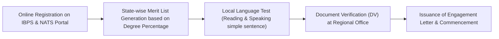

# Canara Bank: Graduate Apprentice Engagement 2026 (3,500 Posts)

> **Recruiting Organization:** Canara Bank (A Premier Public Sector Bank, Govt. of India Undertaking)  
> **Total Vacancies:** **3,500 Posts** (State-wise Pan-India Allotment)  
> **Selection Methodology:** **100% MERIT BASED (ZERO WRITTEN EXAMINATION)**  
> **Monthly Stipend:** **₹15,000/month** (Direct Benefit Transfer via NATS 2.0 Portal)  
> **Application Deadline:** **17 October 2026**

---

## 1. Organization & Post Profiles
* **Recruiting Body:** Canara Bank, Human Resources Wing, Head Office, Bengaluru.
* **Scheme Framework:** National Apprenticeship Training Scheme (NATS 2.0) under the Ministry of Education & Ministry of Skill Development, Govt. of India.
* **Role:** 1-Year on-the-job apprenticeship in commercial banking operations, digital banking products (Canara ai1 mobile banking, UPI, FASTag, Internet banking), customer service assistance, and KYC onboarding.
* **Posting Location:** State-specific branches (allocated based on your selected state/district).

---

## 2. Stipend Structure & Allowances
* **Monthly Stipend:** **₹15,000/month (Fixed)**.
  * ₹10,500 contributed directly by Canara Bank.
  * ₹4,500 contributed by Government of India through Direct Benefit Transfer (DBT) into your Aadhaar-linked bank account.
* **Duration:** Strictly 1 Year (12 Months).
* **Work Hours:** Standard branch operating hours (10:00 AM to 5:00 PM), Monday to Friday, and 1st, 3rd, and 5th Saturdays. 2nd & 4th Saturdays and all Sundays are holidays.

---

## 3. Key Benefits & Career Leverage
* **Zero Written Exam Stress:** No grueling competitive exam. Selection is purely based on your 10th, 12th/Diploma, and Graduation academic performance.
* **Official Govt. National Apprenticeship Certificate:** Issued jointly by Canara Bank and Board of Practical Training (BOPT) / Ministry of Education.
* **Massive Bonus Marks / Quota in Bank Recruits:** Under revised public sector banking recruitment guidelines, candidates possessing completed Bank Apprenticeship Certificates receive weightage and preference in regular Junior Associate / Clerk selections.
* **Live Financial Tech Exposure:** Gain hands-on operational experience in core banking software (Infosys Finacle), treasury, and enterprise network transactions.
* **Immediate Income:** Earn ₹1,80,000 total across the 12-month tenure while preparing for other officer exams in your evening hours.

---

## 4. Exact Eligibility & Age Limits
* **Educational Qualification:**
  * Bachelor’s Degree in ANY discipline from a recognized University (Graduated between 2022 and 2026).
  * **B.Tech CSE Graduates:** Fully eligible.
  * **Diploma + Lateral Entry B.Tech:** **100% Eligible!** AICTE recognized Bachelor's Degree is fully recognized for NATS apprentice engagement.
* **Age Limit (As on 01 September 2026):**
  * **20 to 28 Years** (Born between 02 September 1998 and 01 September 2006).
  * *Relaxation:* OBC: +3 Years (up to 31 yrs); SC/ST: +5 Years (up to 33 yrs); PwBD: +10 Years.
* **Local Language Proficiency:** Candidate must be proficient in reading, writing, and speaking the local language of the State applied for (e.g., Hindi for UP/MP/Bihar/Delhi).

---

## 5. Application Fee
* **General / EWS / OBC:** **₹500** (Inclusive of GST).
* **SC / ST / PwBD:** **₹0 (Completely Exempted)**.

---

## 6. Official Links & Application Portals
* **Canara Bank Official Recruitment Page:** [https://canarabank.com/pages/recruitment](https://canarabank.com/pages/recruitment)
* **Direct Application Portal:** [https://ibpsonline.ibps.in/cbapaug26/](https://ibpsonline.ibps.in/cbapaug26/)
* **Mandatory NATS 2.0 National Portal:** [https://nats.education.gov.in](https://nats.education.gov.in)

---

## 7. Required Documents Checklist
1. **NATS 2.0 Student Enrollment ID:** 16-digit student ID from `nats.education.gov.in`.
2. **Academic Marksheets & Certificates:**
   * 10th Class Marksheet & Certificate (Date of birth verification).
   * 3-Year Polytechnic Diploma Certificate & Final Marksheet.
   * B.Tech Degree / Provisional Certificate & Consolidated Semester Marksheet.
3. **Valid Photo ID:** Aadhaar Card (Mandatory for DBT stipend linking).
4. **Active Bank Account:** Savings Bank account in any scheduled commercial bank seeded with Aadhaar.
5. **Caste / Category / EWS Certificate** (If applying under reserved quota).

---

## 8. Selection Process & Evaluation Pattern (ZERO EXAM)
There is **NO WRITTEN EXAM**. The selection is conducted in 2 simple stages:

1. **Academic Merit List:** State-wise and category-wise merit list generated in descending order of aggregate percentage marks scored in Graduation / B.Tech.
2. **Local Language Test (Qualifying):** Candidate is asked to read 2-3 lines of a local state newspaper or write a simple sentence to verify basic language communication. Candidates who studied the local language in 10th or 12th/Diploma are **exempted from this test**!
3. **Medical Fitness:** Basic medical certificate from a Registered Medical Practitioner (MBBS).

---

## 9. State-wise Vacancy Distribution (Top States)
* **Uttar Pradesh:** 380 Posts
* **Bihar:** 160 Posts
* **Madhya Pradesh:** 210 Posts
* **Rajasthan:** 190 Posts
* **Delhi (NCR):** 140 Posts
* **Karnataka (Head Office State):** 450 Posts
* **Maharashtra:** 320 Posts
* **Tamil Nadu & Andhra Pradesh:** 600+ Posts

---

## 10. Cutoff Trends (Shortlisting Graduation Percentage)
* **General / UR:** 68.5% – 74.0% aggregate in Degree
* **EWS:** 62.0% – 66.5%
* **OBC:** 64.0% – 69.0%
* **SC / ST:** 55.0% – 60.0%

---

## 11. Important Dates & Deadlines
* **Online Application Commencement:** Active
* **Last Date to Apply Online:** **17 October 2026 (11:59 PM)**
* **Merit List Announcement:** Late October / Early November 2026
* **Document Verification & Language Test:** Mid November 2026
* **Commencement of 1-Year Apprenticeship:** 01 December 2026
