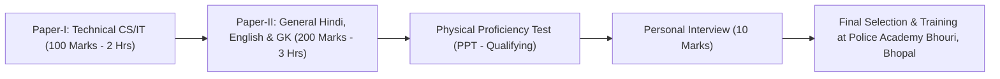

# MP Police Recruitment 2026: Sub-Inspector (SI Radio / Technical) & Subedar (655 Posts)

> **Recruiting Organization:** Madhya Pradesh Police Department conducted by MPESB Bhopal  
> **Total Vacancies:** **655+ Vacancies** (Sub-Inspector & Subedar)  
> **Technical Sub-Inspector Role:** **SI (Radio / Telecommunications / Cyber Technical)**  
> **Candidate Eligibility:** 100% Eligible (**3-Year Polytechnic Diploma in CSE/IT OR B.Tech CSE**)  
> **Uniform Cadre:** **Two-Star Police Officer (Uniformed Sub-Inspector)**

---

## 1. Organization & Post Profiles
* **Recruiting Body:** MPESB on behalf of Madhya Pradesh Police Headquarters (PHQ), Bhopal.
* **Posts:**
  1. **Sub-Inspector (Radio / Technical):** Operates and maintains police wireless communications, encrypted VHF/UHF networks, Dial 100 emergency dispatch servers, cybercrime mobile tracking, and CCTV surveillance command centers.
  2. **Sub-Inspector (District Executive / GD):** Police Station In-Charge / Investigating Officer (Two-Star Police Officer).
  3. **Subedar:** Police lines administration, parade, and tactical security.

---

## 2. Salary Structure & Allowances
* **Rank on Commission:** Sub-Inspector (Two Stars on shoulder epaulettes).
* **Pay Matrix Level:** Level 8 (MP State 7th Pay Matrix).
* **Pay Scale:** ₹36,200 – ₹1,14,800.
* **Basic Pay:** ₹36,200/month.
* **Dearness Allowance (DA):** 46% = ₹16,652/month.
* **House Rent Allowance (HRA):** ₹2,800 – ₹5,800/month (or free Police Quarters inside Police Lines).
* **Police Uniform Allowance:** ₹10,000 annually.
* **Ration & Kit Maintenance Allowance:** ₹2,500/month.
* **Conveyance / Petrol Allowance:** Reimbursed for official investigations.
* **Gross Starting Monthly Salary:** **~₹56,000 – ₹64,000/month**.
* **In-Hand Starting Salary:** **~₹50,000 – ₹57,000/month**.

---

## 3. Benefits & Perks
* **Police Power & Authority:** Sub-Inspector is an empowered Investigating Officer under CrPC/BNSS with power to investigate, register FIRs, and lead technical raids.
* **Government Police Quarters:** Free official residence inside secure District Police Lines.
* **Police Hospital & Ayushman CAPF Healthcare:** Free medical facilities for self and family.
* **State Police Pension:** National Pension System (NPS) with 14% Government contribution.
* **Direct Promotion Pathway:** Eligible for promotion to Inspector of Police (Three Stars) in 5–8 years, and Deputy Superintendent of Police (DSP - State Police Service Gazetted Officer) in 12–15 years.

---

## 4. Exact Eligibility & Age Limits
* **Educational Qualification:**
  * **Sub-Inspector (Radio / Technical):** **3-Year Polytechnic Diploma in Computer Science / Information Technology / Electronics & Telecommunication** OR **B.E. / B.Tech in CSE / IT / Electronics**.
  * **Sub-Inspector (General Duty / Executive):** Any Bachelor’s Degree from a recognized University.
  * **Your Profile (Diploma CSE + B.Tech CSE Lateral Entry):** **100% Eligible for BOTH Technical SI and Executive SI!**
* **Physical Standards (Mandatory for Male Candidates):**
  * **Height:** Minimum **168 cm** (For UR / OBC / EWS / SC); **160 cm** (For ST).
  * **Chest:** **81 cm** unexpanded, **86 cm** expanded (Minimum 5 cm expansion required).
  * **Eyesight:** 6/6 without glasses (no color blindness).
* **Age Limit (As on 01 January 2026):**
  * **18 to 33 Years** (+ 3 years COVID relaxation = **up to 36 Years** for General/EWS).
  * *Relaxation:* OBC / SC / ST / Female: Up to 41 Years.

---

## 5. Application Fee
* **Single Paper (Non-Technical only):** ₹500 (General/Other states) | ₹250 (SC/ST/OBC of MP).
* **Both Papers (Technical + General):** **₹700** (General/Other states) | ₹350 (SC/ST/OBC of MP) (+ ₹60 MP Online portal fee).

---

## 6. Official Links & Application Portals
* **Official MPESB Portal:** [https://esb.mp.gov.in](https://esb.mp.gov.in)
* **Direct Application Portal:** [https://mponline.gov.in](https://mponline.gov.in)

---

## 7. Required Documents Checklist
1. **MP Online Citizen Profile:** Active registration on `rojgar.mp.gov.in`.
2. **Aadhaar Card:** Seeded with mobile for biometric login.
3. **10th Class Marksheet & Certificate** (Date of birth verification).
4. **3-Year Polytechnic Diploma Certificate & Marksheets.**
5. **B.Tech Degree / Marksheets.**
6. **Caste / EWS Certificate** (If claiming reservation benefits).

---

## 8. Selection Process & Exam Pattern

### Paper-I: Technical Paper (For SI Radio / Technical Only)
* **Questions:** 100 Questions | **Marks:** 100 Marks | **Time:** 2 Hours.
* **Subjects:** Computer Science, Electronics, Networking, and Digital Communications.
* **Negative Marking:** **ZERO NEGATIVE MARKING**.

### Paper-II: Non-Technical General Paper (Common for All SI Posts)
* **Questions:** 200 Questions | **Marks:** 200 Marks | **Time:** 3 Hours.
  * General Hindi: 70 Marks (Scoring grammar & comprehension)
  * General English: 30 Marks (Grammar, vocabulary)
  * General Knowledge & Mathematics/Reasoning: 100 Marks

### Stage 2: Physical Proficiency Test (PPT)
* **800 Metres Run:** Completed in under 2 minutes 40 seconds.
* **Long Jump:** Minimum 13 feet (3 attempts).
* **Shot Put (Gola Fenk):** 19 feet throw (Shot weight: 7.26 kg / 16 lbs) (3 attempts).

### Stage 3: Interview
* 10 Marks personality evaluation conducted at Police Headquarters, Bhopal.

---

## 9. Complete Detailed Syllabus

### A. Technical CS/IT Paper (100 Marks)
* Logic gates, Number systems (Binary, Hexadecimal), Microprocessors, Computer hardware, Operating Systems (Linux, Windows commands), Networking (OSI, TCP/IP, IP addressing, Wi-Fi, VHF/UHF communication, Modems), Cyber Security (Firewalls, Antivirus, Phishing, Encryption, Cyber Laws), Database management (SQL commands).

### B. General Paper (200 Marks)
* **General Hindi (70m):** Shabd Roop, Sandhi, Samas, Kriya, Bhed, Vilom, Paryayvachi, Muhavare, Lokoktiyan, Ashuddhi Shodhan.
* **General English (30m):** Tenses, Modals, Determiners, Articles, Prepositions, Voice, Narration, Spotting errors.
* **Mathematics & Reasoning (100m):** Number series, Simplification, Percentage, Profit & Loss, Time & Work, Coding-decoding, Syllogisms, Blood relations, MP State History & Geography, Current Affairs.

---

## 10. Cutoff Trends (Out of 310 Marks: Tech 100 + Non-Tech 200 + Interview 10)
* **General / UR:** 215 – 222 / 310
* **EWS:** 198 – 206 / 310
* **OBC:** 205 – 212 / 310
* **SC:** 182 – 190 / 310
* **ST:** 168 – 176 / 310

---

## 11. Important Dates & Schedule
* **Online Application Window:** Active on MPESB portal
* **Admit Card Release:** 10 days before CBT
* **Written Exam:** Scheduled late 2026
* **Physical Tests:** Conducted at Lal Parade Ground, Bhopal
* **Final Police Training:** Police Training College (PTC) Indore / MP Police Academy Bhopal
