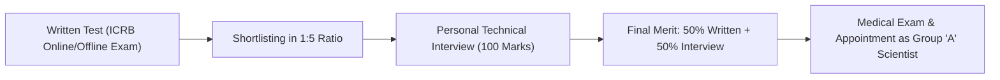

# ISRO Centralised Recruitment Board: Scientist / Engineer 'SC' (Computer Science)

> **Recruiting Organization:** Indian Space Research Organisation (ISRO), Department of Space, Govt. of India  
> **Cadre & Rank:** **Scientist / Engineer 'SC' (Group 'A' Gazetted Central Government Officer)**  
> **Discipline:** Computer Science & Engineering (CS)  
> **Candidate Eligibility:** 100% Eligible (B.E. / B.Tech CSE with minimum 65% aggregate or 6.84 CGPA)  
> **Pay Matrix:** **Level 10 (Gross Starting Salary: ~₹1,05,000 – ₹1,15,000/month)**

---

## 1. Organization & Center Postings
* **Recruiting Body:** ISRO Centralised Recruitment Board (ICRB), Bengaluru.
* **Premier ISRO Centers:**
  1. ISRO Satellite Centre / URSC (Bengaluru) — Satellite embedded software & orbital mechanics coding.
  2. Vikram Sarabhai Space Centre / VSSC (Thiruvananthapuram) — Launch vehicle guidance & flight software.
  3. Satish Dhawan Space Centre / SDSC SHAR (Sriharikota) — Launch pad telemetry & real-time telemetry systems.
  4. Space Applications Centre / SAC (Ahmedabad) — Payload image processing & remote sensing AI.
  5. National Remote Sensing Centre / NRSC (Hyderabad) — Geospatial data analytics & AI vision.
  6. ISRO Telemetry, Tracking and Command Network / ISTRAC (Bengaluru) — Deep Space Network & mission tracking.

---

## 2. Salary Structure & Allowances
* **Pay Matrix Level:** Level 10 (7th Central Pay Commission: ₹56,100 – ₹1,77,500).
* **Basic Pay:** ₹56,100/month.
* **Dearness Allowance (DA):** 50% = ₹28,050/month.
* **House Rent Allowance (HRA):** 30% (Bengaluru / Ahmedabad / Hyderabad) = ₹16,830/month.
* **Transport Allowance (TPTA):** ₹7,200 + DA = ₹10,800/month.
* **Performance Related Incentive Scheme (PRIS):**
  * PRIS(O) Organizational Incentive: Up to 20% of Basic Pay paid twice a year.
  * PRIS(G) Group Incentive: Up to 10% of Basic Pay.
* **Professional Update Allowance:** ₹10,000 annually.
* **Gross Starting Monthly Salary:** **~₹1,11,780/month**.
* **In-Hand Starting Salary:** **~₹96,000 – ₹1,02,000/month**.

---

## 3. Benefits & Perks
* **Elite Space Research Prestige:** Contribute directly to national flagship missions including Gaganyaan (Human Spaceflight), Chandrayaan-4, Bharatiya Antariksh Station (BAS), and Shukrayaan.
* **ISRO Housing Colonies:** Allotment in clean, green, high-security ISRO Housing Colonies (e.g., ISRO Colony Thiruvananthapuram, Antariksh Nagar Bengaluru).
* **Contributory Health Service Scheme (CHSS):** Outstanding 100% free medical cover for self, spouse, children, and dependent parents.
* **Subsidized Departmental Canteens & Official Transport:** Air-conditioned luxury departmental buses connecting residential colonies to launch/research complexes.
* **Leave & Sabbatical:** 30 days Earned Leave, 8 Casual Leaves, 20 Half-Pay Leaves, and provisions for fully paid educational leave for Ph.D. at IISc / IITs.
* **NPS & Gratuity:** National Pension System with 14% Central Government contribution.

---

## 4. Exact Eligibility & Age Limits
* **Educational Qualification:**
  * B.E. / B.Tech or equivalent degree in **Computer Science & Engineering** in **First Class** with an aggregate minimum of **65% marks** or **CGPA 6.84/10**.
  * **Diploma + Lateral Entry B.Tech:** **100% Eligible!** Candidates who completed a 3-Year Polytechnic Diploma in CSE followed by a 3-Year Lateral Entry B.Tech CSE degree are fully recognized, provided the aggregate marks across all B.Tech semesters meet the 65% / 6.84 CGPA requirement.
* **Age Limit (As on Closing Date):**
  * **28 Years** for General / EWS candidates.
  * *Relaxation:* OBC: +3 Years (31 yrs); SC/ST: +5 Years (33 yrs); PwBD: +10 Years.

---

## 5. Application Fee
* **Application Fee:** **₹250**.
* **Processing Fee:** **₹750** (Every candidate pays ₹1,000 total initially; **₹750 is refunded to all candidates who appear for the written test!**).
* **SC / ST / PwBD / Women Candidates:** Full **₹1,000 is 100% refunded** upon appearing in the exam!

---

## 6. Official Links & Application Portals
* **Official ISRO Portal:** [https://www.isro.gov.in](https://www.isro.gov.in)
* **Direct ICRB Recruitment Portal:** [https://www.isro.gov.in/Careers.html](https://www.isro.gov.in/Careers.html)

---

## 7. Required Documents Checklist
1. **10th Standard / Matriculation Certificate & Marksheet** (DOB proof).
2. **3-Year Polytechnic Diploma Certificate & Marksheets.**
3. **B.E. / B.Tech CSE Degree / Provisional Certificate & Marksheets of all Semesters.**
4. **Cumulative CGPA to Percentage Conversion Formula Certificate** issued by the University.
5. **Valid Photo ID:** Aadhaar Card or Passport.
6. **Central Government EWS / OBC-NCL / SC / ST Certificate.**

---

## 8. Selection Process & Exam Pattern
Selection is based on a 2-stage framework:

### Stage 1: ICRB Written Test (Total Time: 120 Minutes)
* **Part 'A': Technical Discipline (Core CS/IT) — 80 Questions (80 Marks):**
  * 1 mark per question; **0.33 negative marking** per incorrect answer.
  * GATE Computer Science standard questions testing deep conceptual clarity.
* **Part 'B': Aptitude / Ability Test — 15 Questions (20 Marks):**
  * Numerical Reasoning, Logical Deduction, Abstract Reasoning. No negative marking in Part B.
* **Qualifying Criterion in Written Test:** Minimum 50% marks in Part A and Part B combined (40% for reserved categories).

### Stage 2: Personal Interview (100 Marks)
* Comprehensive technical interview before a board of senior ISRO scientists and division heads.
* Focuses on: B.Tech major projects, Data Structures & Algorithms, Operating Systems, Computer Architecture, Distributed Systems, and coding problem solving.
* Minimum qualifying mark in Interview: **60% (60/100 Marks)**.

---

## 9. Complete Detailed Technical Syllabus (Computer Science)
1. **Digital Logic & Computer Organization:** Boolean algebra, Karnaugh maps, Combinational and sequential circuits, Instruction pipeline, Hazard mitigation, Cache coherency, Memory hierarchy.
2. **Data Structures & Algorithms:** Arrays, Stacks, Queues, Linked Lists, Trees, Heaps, Graph algorithms (Dijkstra, Bellman-Ford, Prim's, Kruskal), Asymptotic analysis, Dynamic programming, Divide and conquer.
3. **Theory of Computation & Compiler Design:** Regular expressions, Finite Automata, Context-Free Grammars, Pushdown Automata, Turing machines, Decidability, Lexical analysis, Parsing (LL, LR), Intermediate code generation.
4. **Operating Systems:** Process synchronization (Semaphores, Mutexes, Monitors), Deadlocks (Banker's algorithm), CPU scheduling, Virtual memory, Demand paging, File systems, Disk scheduling.
5. **Databases (DBMS):** Relational algebra, SQL, Normalization (1NF, 2NF, 3NF, BCNF), Transaction processing, Concurrency control (Two-phase locking), Indexing (B and B+ trees).
6. **Computer Networks:** OSI and TCP/IP models, Data link layer (Framing, Error detection, Sliding window), Routing algorithms, IPv4/IPv6, Congestion control, Transport protocols (TCP windowing, UDP), Application layer protocols (DNS, SMTP, HTTP), Cryptography (RSA, AES, Hash functions).
7. **Software Engineering & Object-Oriented Design:** Object-oriented concepts (Inheritance, Polymorphism, Abstraction), Software development life cycle, Design patterns, Testing methodologies.

---

## 10. Cutoff Trends (Written Test Shortlisting Score / 100 Marks)
* **General / UR:** 64.50 – 71.00
* **EWS:** 57.00 – 62.50
* **OBC:** 60.00 – 65.00
* **SC:** 48.00 – 54.00
* **ST:** 42.00 – 48.00

---

## 11. Important Dates & Schedule
* **Notification Release:** Annual ICRB recruitment drive
* **Written Examination:** Conducted across all state capitals
* **Interview Rounds:** Held at ISRO Headquarters, Bengaluru / VSSC Thiruvananthapuram
* **Final Selection & Security Clearance:** Group 'A' Appointment by President of India
